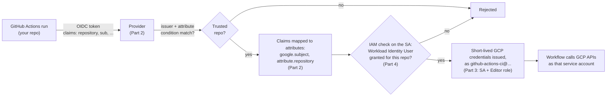

# 003 — Link GitHub Actions to GCP

**Goal:** let GitHub Actions authenticate to your GCP project — as a
specific service account, scoped to only your repo — without ever
storing a GCP key or secret in GitHub.

[Visit the Official Workload Identity Federation Documentation Here](https://cloud.google.com/iam/docs/workload-identity-federation-with-other-providers)

[Visit the Official google-github-actions/auth Action Here](https://github.com/google-github-actions/auth)

## Terminology

New vocabulary this exercise depends on, in the order you'll need it:

- **CI (Continuous Integration)** — an automated system that builds,
  tests, or runs your code every time it changes, instead of a human
  doing it by hand. GitHub Actions is the CI system this course uses;
  it's what needs GCP access in the first place.
- **Service account** — a GCP identity meant for a program to use, not
  a person. It has its own email-like identifier
  (`name@project.iam.gserviceaccount.com`) and its own permissions,
  entirely separate from your personal Google account.
- **IAM (Identity and Access Management)** — GCP's system for deciding
  who can do what, on which resource. Every permission check in GCP —
  "can this identity create a VM," "can this identity read this
  bucket" — goes through IAM.
- **Role** — a named bundle of permissions (e.g. `Editor`, `Storage
  Object Admin`) that IAM grants to someone.
- **Principal** — whoever is asking to do something: a person, a
  service account, or — specific to this exercise — a whole set of
  identities matched by a shared attribute, called a **principalSet**
  (e.g. "every identity whose repo is `you/this-repo`").
- **Token** — signed proof of identity, issued fresh for a single use
  and then expired, as opposed to a password or key that's stored and
  reused indefinitely.
- **OIDC (OpenID Connect)** — a standard way for one system to prove
  an identity to another using a token like the one above, with no
  shared secret involved. This is the standard both GitHub's tokens
  and GCP's federation feature speak.
- **Workload Identity Federation (WIF)** — GCP's feature for trusting
  an outside system's OIDC tokens directly, so an external CI system
  can authenticate without ever holding a downloaded GCP key.
- **Workload Identity Pool / Provider** — the two GCP objects you
  configure to describe that trust: the **Provider** says which token
  issuer to trust and under what conditions (Part 2 below); the
  **Pool** is the container it lives in.

## Why not just a service account key?

The old way to give a CI system access to GCP was: create a service
account, download a JSON key file, paste its contents into a GitHub
secret. That key is a long-lived credential — if it ever leaks (a
misconfigured log, a compromised runner, a secret accidentally
committed), it works forever, from anywhere, until someone notices and
manually revokes it.

**Workload Identity Federation (WIF)** replaces that with a trust
relationship instead of a stored secret: you configure GCP to trust
GitHub's own identity tokens (GitHub already proves, cryptographically,
"this workflow run belongs to repo X" — that's what WIF trusts), and
GitHub Actions exchanges that token for short-lived GCP credentials at
runtime. Nothing is stored in GitHub at all — there's no key to leak,
because no long-lived key exists.

Everything below happens once, entirely in the GCP Console. There's no
GitHub Actions workflow yet — that starts in
[004_basic_pipeline](../004_basic_pipeline), and this trust
relationship gets used for the first time in
[005_pipeline_remote_state](../005_pipeline_remote_state).

## The mental model

Think of it like showing ID at a door, not handing over a spare key.
Every time your GitHub Actions workflow runs, GitHub hands it a
freshly-signed badge — a token that proves, cryptographically, "this
run belongs to repo OWNER/REPO." GCP's **Provider** is the door
person: it checks the badge was really issued by GitHub, checks the
badge's repo matches a rule you wrote, and — only if both check out —
lets that run act as one specific **service account**, just for as
long as the run lasts. Nobody is holding a key that works forever;
it's a badge check, done fresh, every single run.

The five terms from Parts 2–4 below are exactly the five pieces of
that check:



Nothing on this diagram is stored anywhere — every run repeats the
whole check from scratch. Parts 2–4 below build the boxes in order,
left to right.

## Part 1 — Confirm the required API is enabled

1. In the [console.cloud.google.com](https://console.cloud.google.com),
   confirm your project is selected (top-left picker).
2. Search bar → **APIs & Services** → **Library**.
3. Search for **IAM Service Account Credentials API**. If it says
   **Enable**, click it. Most projects already have this on — this is
   just a check.

## Part 2 — Create a Workload Identity Pool and Provider

1. Search bar → **Workload Identity Federation** (under IAM & Admin).
2. Click **Create Pool**.
   - **Name:** `github-actions-pool` (the Pool ID auto-fills from
     this).
   - Click **Continue**.
3. **Add a provider to pool:**
   - **Provider type:** OpenID Connect (OIDC).
   - **Provider name:** `github-actions-provider`.
   - **Issuer (URL):** `https://token.actions.githubusercontent.com`
   - Leave **Audience** on its default.
   - Click **Continue**.
4. **Configure provider attributes** — this is the mapping between
   GitHub's identity token claims and attributes GCP can use in
   permission rules. The Console pre-fills one row,
   `google.subject = assertion.sub` — leave that one as-is. Click **Add
   mapping** twice more and add these two:
   | Google attribute | Maps from |
   |---|---|
   | `attribute.repository` | `assertion.repository` |
   | `attribute.repository_owner` | `assertion.repository_owner` |
   You should end up with three rows total.
5. **Attribute condition** (required) — restrict which GitHub repos
   this provider will trust *at all*, before any IAM grant even comes
   into play:
   ```
   assertion.repository == 'YOUR_GITHUB_USERNAME/gitops-intro-gha-tf-gcp'
   ```
   Replace with your actual `owner/repo`. Without this, the provider
   would trust a token from *any* GitHub repository that knows its
   resource name — not just yours.
6. Click **Save**.

## Part 3 — Create the CI service account

1. Search bar → **Service Accounts**.
2. **+ Create Service Account.**
   - **Name:** `github-actions-ci`.
   - Click **Create and Continue**.
3. On the **Grant this service account access to project** screen,
   click the **Select a role** dropdown, type `Editor` into the filter
   box, and select the **Editor** role from the filtered list. (This
   is broader than a production setup should use — see Pro-tips for
   the least-privilege alternative.)
4. Click **Continue**, then **Done** (no need to grant users access to
   this service account — skip that screen).

## Part 4 — Connect the provider to the service account

This is the step that actually authorizes GitHub Actions (from your
repo specifically) to *use* this service account:

1. Back in **Workload Identity Federation**, open the
   `github-actions-pool` you created.
2. Click **Grant Access** (or the **Connected Service Accounts** tab →
   **Grant Access**).
3. Select the `github-actions-ci` service account.
4. Choose **Only identities matching a specific attribute value**:
   - Attribute name: `repository`
   - Attribute value: `YOUR_GITHUB_USERNAME/gitops-intro-gha-tf-gcp`
5. Click **Save**. This grants the `Workload Identity User` role,
   scoped specifically to your repo, on the service account — this and
   the attribute condition in Part 2 step 5 are two independent checks
   that both have to pass, not one.

## Part 5 — Record what you'll need in 005

1. Still on the provider's page, copy its **resource name** — looks
   like:
   ```
   projects/PROJECT_NUMBER/locations/global/workloadIdentityPools/github-actions-pool/providers/github-actions-provider
   ```
2. Copy the service account's **email** — looks like:
   ```
   github-actions-ci@YOUR_PROJECT_ID.iam.gserviceaccount.com
   ```

Save both somewhere — [005_pipeline_remote_state](../005_pipeline_remote_state)
plugs them directly into the `google-github-actions/auth` step of your
workflow.

## Success criteria

On the service account's **Permissions** tab (IAM & Admin → Service
Accounts → `github-actions-ci` → **Permissions**), you should see one
principal with the `Workload Identity User` role, whose name contains
your pool ID and your `owner/repo` — not a wildcard, not any other
repo.

## Pro-tips

- **Least-privilege alternative to Part 3's `Editor` grant:** instead
  of `Editor` at the project level, grant only `Storage Object Admin`
  scoped to just your state bucket (Cloud Storage → your bucket →
  Permissions → Grant Access) plus whatever narrower roles each later
  exercise's resources actually need. `Editor` is used here so this
  course doesn't send you back to IAM every time a new exercise
  introduces a new resource type — real production setups should
  scope this much tighter, the same way
  `gcp-infra-as-code`'s `020_state_bucket_least_privilege` scopes
  access to the state bucket itself.
- Nothing here is testable end-to-end yet — there's no workflow to run
  it from until [005_pipeline_remote_state](../005_pipeline_remote_state).
  If something's misconfigured, you won't find out until then; it's
  worth re-reading Parts 2 and 4 once you get there if auth fails.
- The attribute condition in Part 2 and the "Grant Access" scoping in
  Part 4 both restrict by repository, redundantly, on purpose — GCP's
  own guidance recommends never relying on just one.
